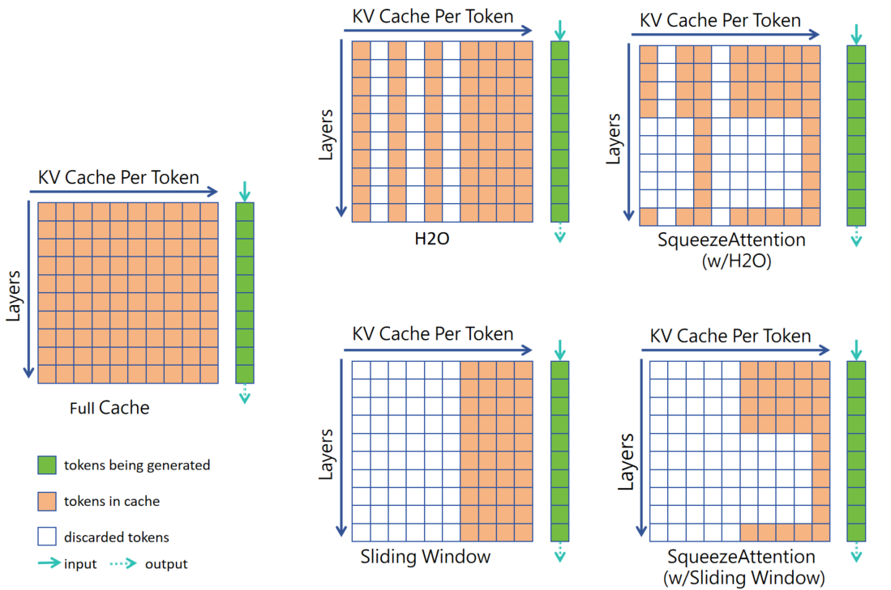

# SqueezeAttention: 2D Management of KV-Cache in LLM Inference via Layer-wise Optimal Budget


## Abstract


Optimizing the Key-Value (KV) cache of the Large Language Model (LLM) has been considered critical to saving the cost of inference. Most of the existing KV-cache compression algorithms attempted to sparsify the sequence of tokens by taking advantage of the different importance of tokens. In this work, we found that by identifying the importance of attention layers, we could optimize the KV-cache jointly from two dimensions. Based on our observations regarding layer-wise importance in inference, we propose SqueezeAttention to precisely optimize the allocation of KV-cache budget among layers on-the-fly and then incorporate three representative token sparsification algorithms to compress the KV-cache for each layer with its very own budget. By optimizing the KV-cache from both sequence's and layer's dimensions, SqueezeAttention achieves around 30% to 70% of the memory reductions and up to 2.2 $\times$ of throughput improvements in a wide range of LLMs and benchmarks.




## Installation

Use the following command to install dependencies.

```bash
pip install crfm-helm
pip install -r requirements.txt
```

Then, install [FlashAttention-2](https://github.com/Dao-AILab/flash-attention)

```bash
pip install flash-attn --no-build-isolation
```

Next, run `modify_transformers.py` to modify transformers. :warning: Please make sure you do run this program, otherwise, error will be reported after executing the following codes.

```bash
python modify_transformers.py
```


## Usage and Example

We provide two dataset(**samsum** from [LongBench](https://github.com/THUDM/LongBench) and **xsum** from [HELM](https://crfm.stanford.edu/helm/latest/)) and two models(**Mistral** and **LLama2-7b-32k**) as examples. You can also use LLama of other sizes.

Before you run the experiments, please modify `config/model2path.json` to provide correct path of your models based on you machines.

### Evaluation on samsum using Mistral

1. Using Sliding Window without **SqueezeAttention**.

   This code will generate the output from Mistral with 21% KV Budget(0.21 * prompt length) of each layer.

   ```bash
   python pred.py --model Mistral --pred Long --enable_squeeze --model_arch Mistral --device cuda:0 --ini_size 0.21 --KV_class3 0.21
   ```

   Then, running **eval.py**, the result will be written into a json file which can be found in `pred_Long/Mistral/0.21/21/result.json`, you can also find detailed result in `samsum.jsonl`

   ```bash
   python eval.py --model Mistral --pred Long --ini_size 0.21 --KV_class3 0.21
   ```

2. Using Sliding Window with **SqueezeAttention**.

   In program `pred.py`, parameter `--ini_size` means the initial KV Budget of each layer, `--KV_calss3` means KV Budget of layers in class3(probably are second half layers) after cluster. If you set `--KV_class3` to other number, **SqueezeAttention** will compute the KV Budget of remaining layers to ensure that the total KV Budget of all layers before and after change is equal. Here, we provide a parameter where **SqueezeAttention** can significantly improve score.

   ```bash
   python pred.py --model Mistral --pred Long --enable_squeeze --model_arch Mistral --device cuda:0 --ini_size 0.21 --KV_class3 0.08
   ```

   Running `eval.py` and check the result.

   ```bash
   python eval.py --model Mistral --pred Long --ini_size 0.21 --KV_class3 0.08
   ```

### Evaluation on xsum using LLama2-7b-32k

1. Using streamingLLM without **SqueezeAttention**.

   StreamingLLM needs a few "sink tokens", in our experiments, we take first 4 tokens as "sink tokens", so you should add a parameter `--start_token`.

   ```bash
   python pred.py --model llama2-7b-32k --pred xsum --enable_squeeze --model_arch llama --device cuda:0 --ini_size 0.4 --KV_class3 0.4 --sample_num 300 --start_size 4
   ```

   Evaluate **xsum** can be a little complicated,  first, you should open `script/helm.sh` and modify `ini_size=0.4`, `KV_class3=0.4` based on your last command. Then, run `helm.sh`.

   ```bash
   sh helm.sh
   ```

   The main result will be printed on your screen, you can also find detailed result in `helm/benchmark_output/runs/latest`.

2. Using streaming with **SqueezeAttention**.

   Generating output is quite similar with Mistral, all you need to do is modifying `--KV_class3`.

   ```bash
   python pred.py --model llama2-7b-32k --pred xsum --enable_squeeze --model_arch llama --device cuda:0 --ini_size 0.4 --KV_class3 0.25 --sample_num 300 --start_size 4
   ```

   Before you evaluate the result, don't forget to change parameter `--KV_class3=0.25` in `script/helm.sh`.

   ```bash
   sh helm.sh
   ```
## Cite SqueezeAttention
```
@inproceedings{wang2024squeezeattention,
title={SqueezeAttention: 2D Management of KV-Cache in LLM Inference via Layer-wise Optimal Budget},
author={Zihao Wang and Shaoduo Gan},
year={2024},
eprint={2404.04793},
archivePrefix={arXiv},
primaryClass={cs.LG}
}
```

